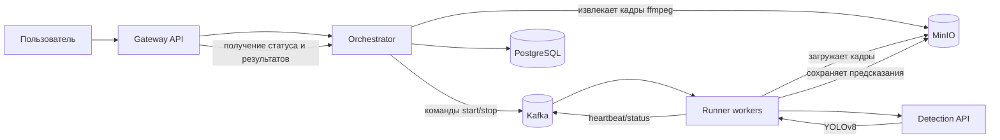

# Video Analytics

Проект видеоаналитики, разработанный в рамках курса по распределенным системам. Система принимает видео, раскладывает его на кадры, распределяет обработку через очередь событий и выполняет детекцию объектов на кадрах с помощью YOLO-модели.

Цель проекта — показать полный backend-пайплайн для асинхронной обработки видео: от загрузки файла и постановки сценария в обработку до сохранения результатов инференса и получения предсказаний через API.

## Архитектура



## Основные компоненты

- `gateway` — внешний FastAPI-сервис для загрузки видео, управления сценариями и получения результатов.
- `orchestrator` — сервис управления сценариями: создает задачу, извлекает кадры через `ffmpeg`, сохраняет их в MinIO и отправляет команды обработки.
- `runner` — воркеры, которые читают команды из Kafka, забирают кадры из MinIO, вызывают сервис детекции и сохраняют результаты.
- `detection` — отдельный FastAPI-сервис инференса, использующий YOLOv8 для поиска объектов на изображениях.
- `PostgreSQL` — хранение состояния сценариев.
- `Kafka` — обмен событиями между управляющим сервисом и воркерами.
- `MinIO` — объектное хранилище для кадров и JSON-файлов с предсказаниями.

## Поток обработки

1. Пользователь загружает видео через `gateway`.
2. `orchestrator` создает сценарий обработки и извлекает кадры из видео.
3. Кадры сохраняются в MinIO, а команда на обработку отправляется в Kafka.
4. `runner` получает задачу, последовательно обрабатывает кадры и вызывает `detection`.
5. `detection` возвращает bounding boxes, классы объектов и confidence scores.
6. `runner` сохраняет результаты в MinIO и отправляет heartbeat-события.
7. Пользователь может запросить статус сценария и результаты обработки через API.

## Запуск

```bash
make up
```

Команда поднимает систему через `docker-compose` и масштабирует `runner` до нескольких воркеров.

Полезные команды:

```bash
make logs
make ps
make down
```

## Что демонстрирует проект

- проектирование микросервисной архитектуры для обработки видео;
- асинхронную обработку задач через Kafka;
- разделение API, оркестрации, воркеров и ML-инференса;
- хранение промежуточных данных и результатов в объектном хранилище;
- интеграцию YOLO-модели в backend-пайплайн.
